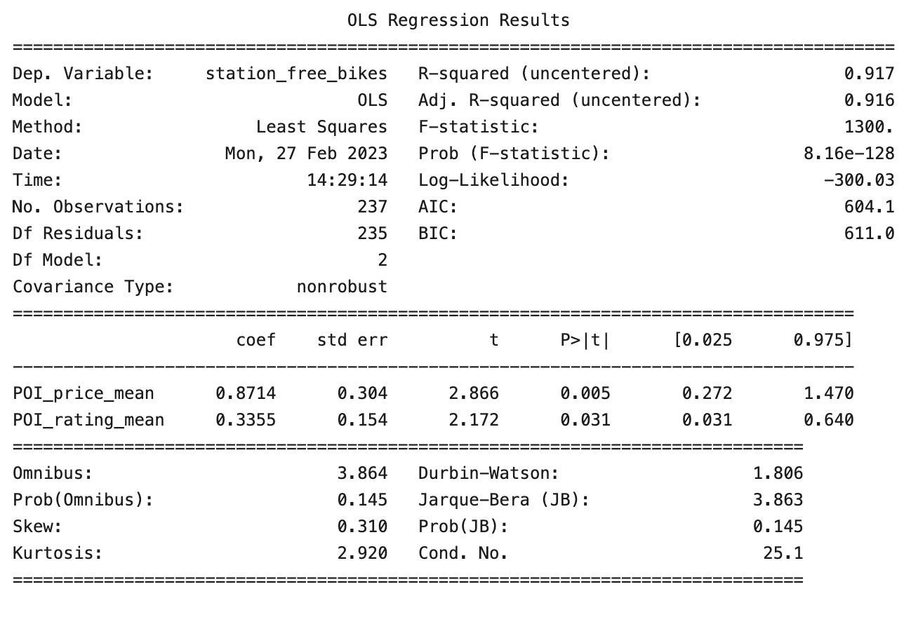
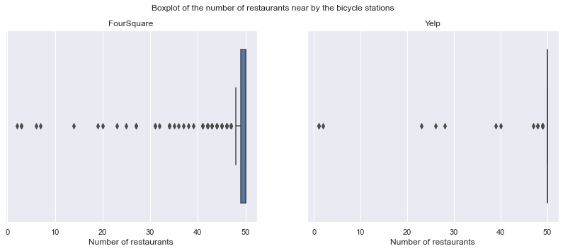

# Final-Project-Statistical-Modelling-with-Python

## Project/Goals

* Steps 1 and 2 are the extraction of the data from the website by using APIs and the creation of the data frames from JSON files.

* Step 3 is transforming data into a pandas data frame and cleaning the data and merging the data frames based on the EDA process; then the data frames are loaded into the SQLite database.

* Step 4 is the regression model creation and the demonstration of the relationship between the number of bikes in a station and the surrounding POI's characteristics.

* Note: On my computer, in all the *.ipynb files, the figures created by plotting codes are hidden and not visible by default. I need to click the three dots to the left of where the figures are supposed to be, choose change presentation, and from the dropdown menu from the top-center of the VSCode window select: `Jupyter Notebook Renderer  (ms-toolsai. Iupyter-renderers)`. Therefore, any person experiencing the same issue while reading the *.ipynb can try to `change presentation` mode to make the figures visible.

## Process
-----------------
### Step 1: CityBike API request - E of ETL
* Explore the structure of the API, query the API and understand the data returned.
* Choose the city of Vancouver, BC, Canada, and retrieve all available bike stations in that city. The responding JSON file is converted as a pandas data frame, and saved as a CSV file "target_city_stations_DF.csv".
-----------------
### Step 2: FourSquare/Yelp API requests - E of ETL
* The embedded loop structure is used to request the data from the API. The outer for-loop is on the list of categories, and the inner for-loop is on the list of stations. This structure facilitates any future expansion of the categories. 

* A self-defined POI category name is added to the result data frames so that the data frames can be merged by the category name. Otherwise, the multiple-category classification returned from the API will be confusing to merge the data frames. 

* The dictionary with the key as the self-defined POI category name and value as the API category ID/classification is created to facilitate the future expansion of the categories.

#### Takeaways
* When requesting the data, make sure to transfer only one category per request, otherwise, the returns from the "popular" categories will take up all 50 positions, which is the API limit per request.
* By adopting the method of one category per request, the flexibility of adding more categories in the future is retained.
-----------------
### Step3: T&L of ETL, with EDA

* The ipynb file encloses all the practices I have done as a future reference for myself. To look at the part for merging the data frames for step 4, please go to the section: ***Merge a POI-centric data frame***. The data frame is named **DF_stations_yelp_POIs_Charac_pivot**.

* This is the T and L of ETL. The EDA is done in this step.

* The merging of the data frames is a creative process. It is gradually done by the EDA process. 

* Before merging the data frames, the shape of the yelp data frame is (48014, 18), and the city bike data frame is (241, 15). 
By dropping the duplicated categories from yelp API, the merged data frame shape is (26498, 25). For answering the question in Step 4, I created a pivot table with the shape (241, 21). This data frame is loaded into the SQLite database. When answering it, only part of it is used.

#### Takeaways
* Rename the columns in an analyst-read-friendly format. It may lose some structural identifiers from the JSON file.

* Merge or create new data frames while doing ***Exploratory Data Analysis (EDA)***. This is an interactive procedure.

* In this step, it is better to change the column names and string type values by substituting the ' ' with '_', otherwise, some subsetting and slicing operations may raise exceptions.

* When using CSV files to save and read back data, it is better to keep the index column.

-----------------
### Step4: Modeling

* I use the OLS model to fit the data. The dependent variable is the number of bikes in a station. The independent variables are the POIs' characteristics (average distance, rating, review number, and price).

* I use a backward elimination method to select the independent variables. 

* The p-value threshold for the backward elimination is either 0.0001 (for the first round, to get the most important variables) or 0.05 (for the subsequent rounds, to get all the statistically significant variables).

* Normality and Homoscedasticity assumptions are tested.
     - Normality assumption: qqplot, histogram, and Shapiro-Wilk test
     - Homoscedacity assumption: scatter plot, Breusch-Pagan test

* The conclusion is the number of bikes in a station is positively correlated with the number of average ratings and prices. 

| Dep. Var. Transform | Indepedant Variable |Coefficient | p-value  | Normality Assumption | Homoscedacity Assumption |
| --- | --- | --- | --- | --- | --- |
| linear | POI_price_mean | 4.7034 | 0.000 |  No | No |
| log | POI_rating_mean  |0.5438 | 0.000 | No | No |
| square root | POI_price_mean | 1.5285 | 0.000 | Yes | No |
| cube root | POI_rating_mean | 0.5415 | 0.000 | Yes | No |

#### Takeaways

* The modeling process is iterative. It is not a one-time process.
* Assumption testing is essential. 

-----------------
## Results

* The FourSquare API uses a category classification number, which is more coding-friendly than Yelp's category classification name. 

* The number of returns is almost the same for the two APIs. The FourSquare API wins slightly in the number of returns for my choice of POI categories.

* From the boxplot of the number of surrounding restaurants within 1km of each bike station, we can see a mean of 46.8, a median of 50, and a maximum of 50. This is a highly left-skewed distribution. The reason is that the maximum number of restaurants is restricted by the API request limit. 

* This is a violation of the assumption of normality. For educational purposes, I will still practice using the OLS model to fit the data. However, in real life, the GLM model should be used to fit the data. Or when requesting the data, we can either use a smaller radius or purchase a higher API limit, to ensure this variable is in a normality distribution.

## Challenges 
* The API requests and JSON normalization are the most challenging parts of this project. 
* The merging of data frames is more art than science. It requires a deep understanding of the data and the questions to be answered.
* The choice of model is the most important part of the project. A proper model can answer the questions. A wrong model can be misleading.

## Future Goals
* I would need to read more about the modeling process to ensure the choice of model is correct.

